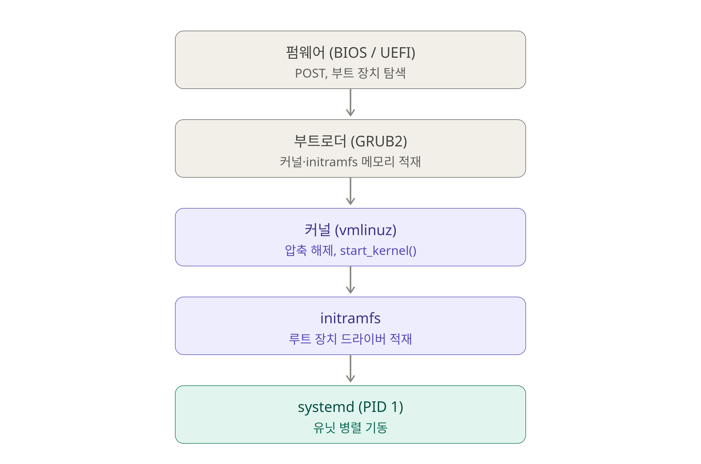

# 리눅스에 대한 전반적인 학습 내용 정리

## 1. Linux Foundation Certified System Administrator (LFCS)

## 2. 리눅스 부팅 순서
> 학습 순서

## 3. 3-tier 자동화 스크립트
> 우분투 서버 환경에서 직접 web(nignx) / was(tomcat) / db(mysql)을 설치하고 이 과정을 셸 스크립트로 자동화하였다.   
> 각 버전별로 고도화가 진행되었으며 이 과정을 통해 기존 20분 정도의 소요 시간을 2분 이내로 단축 할 수 있었다.   
> 추가로 오타로 인한 오류 발생 가능성을 제거 하였으며 누가 실행하더라고 같은 결과를 내는 멱등성 역시 확보하였다.
> > v1. 가장 기본적인 형태로 파일 안에 mysql에서 사용할 아이디와 비밀번호를 작성하여 실행한다.   
> > v2. 기존 스크립트 파일에 민감한 정보가 드러나 있어 이를 보안하고자 사용자의 입력을 받아 아이디, 비밀번호를 설정하도록 하였다.  
> > v3. v2까지 스크립트에 결합도가 너무 높다고 판단하여 이를 각 책임에 맞게 나누어 정리하였다.  
> > > 하지만 이 과정에서 v2에서 해결했던 보안에 문제가 발생하였다.  
> > v4. 
